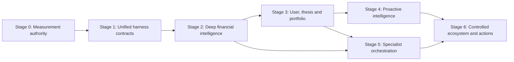

# AI capability roadmap

Roadmap này là đường tiến hóa riêng của AI trong Stock_Massive. Nó không theo
lịch release và không sao chép feature list của Hermes/OpenCode. Một stage chỉ
tốt nghiệp khi graduation gate đạt; stage sau có thể được prototype nhưng không
được trở thành default trước dependency của nó.

## Destination

Đích đến là một Investment Intelligence runtime có thể tự tổ chức nghiên cứu,
kết hợp dữ liệu point-in-time, duy trì thesis, mô phỏng kịch bản, hiểu portfolio,
theo dõi material change và dùng specialist khi có lợi—trong một trace mà người
dùng và maintainer có thể kiểm chứng.

Năng lực đích được chia thành bảy pillar:

| Pillar | Năng lực đích |
|---|---|
| Perceive | Đọc market, filing, flow, news, user/portfolio context với provenance |
| Investigate | Lập kế hoạch research nhiều bước, chọn tool và kiểm mâu thuẫn |
| Reason | Tạo claim, hypothesis, scenario và judgment theo evidence contract |
| Remember | Duy trì preference, thesis, question và prior judgment có lifecycle |
| Simulate | Phân tích sensitivity, risk, portfolio và counterfactual xác định |
| Collaborate | Gọi specialist có context/permission/budget cô lập khi có uplift |
| Monitor and act | Theo dõi material change, đề xuất action; execution chỉ theo autonomy contract |

“Full capability” không có nghĩa một model làm mọi việc. Harness phải chọn giữa
deterministic engine, retrieval, primary model, specialist hoặc human approval
theo task contract.

## Current baseline

Baseline hiện tại đã có nhiều production invariant tốt. Roadmap giữ chúng và
deepening từ đây thay vì reset kiến trúc.

**Current strengths:**

- FastAPI/SSE product runtime với durable thread/turn/message/tool trace;
- bounded chat và Analysis loops;
- typed provider failures, recovery, breaker, spend admission và deadlines;
- capability registry/toolsets/definitions/executor với availability,
  provenance và human display metadata;
- one-call-one-result, parallel-read barriers và guardrail ladder;
- stable prompt contract, context reduction và external-content delimiter;
- Signal Field/evidence envelope có as-of, health và refusal semantics;
- read-only web, memory, price-check và signal capabilities;
- Analysis trace và một số operational quality metrics.

**Binding gaps:**

- chưa có paid baseline được owner review, approved digest và threshold khóa;
- evidence identity chưa thống nhất xuyên chat, Analysis, news và portfolio;
- capability declaration vẫn chưa phải owner duy nhất cho mọi policy/trace/UI;
- context quality/cache/compaction chưa có baseline đầy đủ;
- financial research planner, scenario/thesis/portfolio modules chưa hoàn chỉnh;
- proactive task, specialist tree và global orchestration budget chưa tồn tại;
- autonomy trên read-only decision support chưa được product/legal chấp nhận.

## Dependency map

Roadmap đi từ measurement và truth đến autonomy. Multi-agent hoặc proactive
không được đi vòng qua evidence/eval foundation.

Stage là dependency boundary, không nhất thiết là một project duy nhất. Trong
mỗi stage, chọn vertical slice nhỏ nhất tạo measurable user outcome.

## Stage 0 — Restore measurement authority

**Target.** Mọi thay đổi harness có baseline và release evidence. Đây là blocker
cho các stage còn lại cho tới khi paid baseline đầu tiên được phê duyệt.

### Capability delivered

Stage này tạo measurement system, không thay answer architecture.

- Golden Investment Intelligence set theo task families.
- Frozen point-in-time evidence fixtures và replay runner.
- Deterministic graders cho figure, unit, as-of, citation, refusal và policy.
- Rubric grader cho synthesis, counterargument, uncertainty và utility.
- Multi-trial runner với model/config/prompt/tool/data version stamp.
- Adversarial/fault-injection cases cho provider, context, tool và untrusted
  content.
- Report artifact so baseline/candidate theo hard dimensions và cost/latency.

### Graduation gate

Stage tốt nghiệp khi một maintainer có thể thay prompt hoặc tool schema, chạy
một command owner trong repo và nhận report tái tạo được gồm outcome quality,
hard-dimension regressions, token/cost/latency và failure samples. Threshold ban
đầu được khóa sau baseline review, không để candidate tự đặt.

Replay, grader, artifact và command owner hiện nằm tại
[`src/eval`](../../apps/api/src/eval/),
[`eval/gate-policy.json`](../../apps/api/eval/gate-policy.json) và các target
`eval-*` trong [`apps/api/Makefile`](../../apps/api/Makefile). Stage vẫn ở trạng
thái **Target** cho tới khi
[`baseline summary`](../../apps/api/eval/baselines/investment-intelligence-v1.json)
trỏ tới một paid artifact hoàn chỉnh đã được owner review; offline smoke không
tự nâng trạng thái này.

### Do not build yet

Không thêm general subagent, MCP marketplace, autonomous monitor hoặc LLM
compaction trước khi runner đo được chúng.

## Stage 1 — Unify harness contracts

**Target.** Capability, lifecycle, evidence reference và telemetry có một owner
theo seam. Mục tiêu là giảm drift và tạo nền cho depth, không gom code thành một
monolith mới.

### Capability delivered

Stage này deepening các module hiện tại.

- Resolved capability declaration thống nhất schema, availability, provenance,
  mutability, concurrency, budget, policy và display.
- Typed tool/task transition bền: pending, running, completed, error,
  interrupted và blocked.
- Stable root/attempt/call/evidence identity trên state, SSE và ops.
- Evidence reference contract dùng chung giữa chat và Analysis.
- Provider semantic capability probe, không chỉ connectivity probe.
- Context composition telemetry theo layer và cache tokens/hit/churn.
- Content-light observer schema tách khỏi rich trajectory.
- Config/default contract tests để ngăn docs/runtime drift.

### Graduation gate

Stage tốt nghiệp khi thêm một read-only financial capability không cần sửa bảng
tên hoặc policy song song; model, executor, trace, budget và UI đọc cùng
declaration. Disconnect/reconnect và mọi terminal path cho cùng settled state;
golden outcome không regression.

### Migration order

Thực hiện theo seam để giữ behavior.

1. Chốt contract tests trên owner hiện tại.
2. Tạo resolved view từ registration hiện tại.
3. Chuyển từng consumer sang view chung.
4. Thêm durable transition nơi product cần replay.
5. Xóa duplicate owner sau khi caller cuối chuyển xong.

## Stage 2 — Deep financial intelligence

**Target.** AI chuyển từ “đọc một vài figures rồi diễn giải” sang research planner
có evidence graph, domain methods và scenario discipline.

### Capability delivered

Stage này mở rộng perception và reasoning trong read-only autonomy A1.

- Evidence plane thống nhất observation, derived metric, document/event, claim,
  conflict và lineage.
- Research planner chọn axis/evidence theo câu hỏi, không gọi toàn bộ toolset.
- Progressive domain packs cho technical, fundamental, flow, event, peer và
  risk knowledge.
- Deterministic financial calculation modules theo method/version contract.
- News/event normalization: entity, event type, materiality evidence,
  publication/effective time và duplicate cluster.
- Claim-evidence binding và contradiction/falsifier extraction.
- Bull/base/bear scenario với assumption và sensitivity, không probability giả.
- Artifact output cho research memo, comparison và evidence appendix.
- Context planner: deterministic prune, evidence handles, protected citations
  và recovery search.

### Vertical slices

Ưu tiên các slice tạo intelligence rõ hơn thay vì tăng tool count.

1. **Explain a material move:** price/volume + market + event + liquidity,
   conflict-aware và point-in-time.
2. **Evaluate a thesis:** evidence for/against + falsifiers + scenario.
3. **Compare opportunities:** point-in-time peers/universe + sample health.
4. **Assess valuation and quality:** filing-time-safe fundamentals + method
   version + uncertainty.

### Graduation gate

Stage tốt nghiệp khi planner tốt hơn fixed envelope/single-pass baseline trên
task success và evidence coverage, không regression temporal correctness,
không tăng unsupported claim, và cost/latency nằm trong envelope được chấp
nhận. Context reduction phải giữ cited evidence và replay accuracy.

### Do not build yet

Không dùng LLM để tính metric đã có deterministic method. Không mở “sentiment
score” nếu chưa có event/entity/source benchmark. Không gọi một specialist cho
mỗi axis mặc định.

## Stage 3 — User, thesis and portfolio intelligence

**Target.** AI chuyển từ generic stock analysis sang intelligence phù hợp mục
tiêu, holdings và risk context đã được xác nhận.

### Capability delivered

Stage này tạo continuity và portfolio semantics mà không tăng action authority.

- Typed user objective, horizon, constraints và communication preference.
- Portfolio snapshot có source/freshness và user ownership.
- Thesis record versioned: claim, evidence, assumptions, falsifiers, horizon và
  status.
- Cross-position exposure, concentration, liquidity, factor và correlation
  uncertainty.
- Scenario/stress engine trên portfolio với deterministic arithmetic.
- Decision journal nối judgment với evidence/as-of và outcome sau đó.
- Memory proposal/review/delete UI; stale hoặc contradicted memory không âm
  thầm chi phối answer.
- Clarification policy khi suitability context chưa đủ.

### Graduation gate

Stage tốt nghiệp khi cùng một market evidence tạo implication khác nhau đúng
theo hai frozen user/portfolio contexts, không leak chéo user, không suy đoán
missing preference và không đưa personalized action khi context thiếu. Portfolio
math và temporal joins phải deterministic.

### Conditional boundary

Action proposal A3 chỉ được mở sau product/legal decision về research versus
advice, user-context contract và human approval UX. Stage này không gửi lệnh.

## Stage 4 — Proactive intelligence

**Target.** AI duy trì standing goals và chỉ chủ động khi evidence mới làm thay
đổi material judgment, thay vì spam theo lịch.

### Capability delivered

Stage này mở autonomy A2 với durable, read-only background work.

- User-owned monitor cho thesis falsifier, material event, filing, flow hoặc
  risk threshold.
- Durable checkpoint và incremental evidence window.
- Materiality/dedupe policy; source outage không biến thành market alert.
- Scheduled brief tổng hợp only-new evidence và unresolved items.
- Budget, expiry, quiet hours, pause/delete và delivery state.
- Trigger-to-outcome trace và feedback về useful/dismissed/noisy.
- Backfill/recovery không gửi duplicate notification.

### Graduation gate

Stage tốt nghiệp trong shadow mode trước: material events được bắt với delay và
coverage được chấp nhận; duplicate/noise nằm trong threshold product đã khóa;
không alert từ stale/conflicted/refused evidence; crash/retry không gửi lặp;
monthly cost có bound.

### Do not build yet

Không cho standing goal tự mở rộng scope, tạo goal con vô hạn hoặc chuyển từ
monitor sang broker action.

## Stage 5 — Specialist orchestration

**Conditional target.** Specialist chỉ được mở sau khi Stage 0 đo được
single-agent bottleneck và Stage 1–2 cung cấp evidence/capability contracts dùng
chung. Spawn là mechanism; uplift mới là product capability.

### Candidate specialists

Role được chọn theo independent work và output contract, không theo mong muốn
có “team AI”.

| Specialist | Output contract | Khi đáng gọi |
|---|---|---|
| Evidence collector | evidence references + gaps + source confidence | nhiều nguồn/filing độc lập |
| Fundamental analyst | claims + calculations + contradictions | filing/peer depth lớn |
| Market/microstructure analyst | regime, tradability, technical evidence | move/liquidity question |
| Event analyst | normalized event, materiality evidence, timeline | news/event ambiguity |
| Portfolio/risk analyst | exposure, scenario, constraints | multi-position implication |
| Skeptical verifier | unsupported claims, counterevidence, falsifiers | high-impact final judgment |

### Runtime requirements

Specialist dùng child task bền trên cùng runtime.

- fresh, scoped context và explicit as-of;
- capability allowlist và monotonic deny;
- structured output fail-closed;
- root-wide child/depth/token/cost/deadline cap;
- foreground/background cancellation và durable settlement;
- deterministic result join và conflict representation;
- full trace accessible, summary/evidence only quay về parent context;
- no shared mutable scratch state nếu thiếu ownership/transaction.

### Graduation gate

Mỗi specialist phải thắng single-agent baseline trên task family riêng với
confidence đủ, sau khi tính wall-clock, token, cost, redo và failure. Parent
không được làm lại phần lớn output. Security tests phải chứng minh child không
thoát data scope hoặc action policy.

### Rejection rule

Nếu uplift chỉ đến từ model mạnh hơn, dùng model đó trực tiếp trước khi giữ
orchestration. Nếu task có một evidence path ngắn, chạy inline. Nếu deterministic
engine giải được, không gọi specialist.

## Stage 6 — Controlled ecosystem and actions

**Conditional target.** Stage này mở external capability hoặc action proposal
chỉ khi product cần và threat model đã đổi. Nó không mặc định bao gồm autonomous
trading.

### Capability delivered

Khả năng có thể gồm:

- approved provider/MCP adapters có narrow contract;
- secure document workspace hoặc sandboxed computation cho user artifacts;
- export research memo, scenario hoặc proposed order ticket;
- human-approved write action có idempotency và reconcile;
- broker portfolio sync read-only;
- broker execution chỉ khi một quyết định SOT mới thay autonomy level A4.

### Graduation gate

Mỗi external adapter cần security review, least-privilege credential, data
scope, network policy, conformance tests, audit, revoke/disable và incident
runbook. Mỗi write cần preview, explicit approval, idempotency, status reconcile
và immutable receipt.

### Hard stop

Không dùng plugin package hoặc generic MCP trust để mở capability hàng loạt.
Không truyền user credential cho model hoặc third-party server. Không coi
provider annotation là authorization. Không retry unknown-state write.

## Capability scorecard

Roadmap progress được nhìn theo outcome pillars, không theo số module hoặc tool.
Scorecard luôn link tới machine-owned eval/ops artifacts khi chúng tồn tại.

| Pillar | Current | Target evidence |
|---|---|---|
| Perceive | Store Signal Fields + bounded web/memory | evidence coverage, freshness, conflict and source quality |
| Investigate | Multi-round chat/Analysis loops | planner uplift, tool usefulness, invalid/repeat rate |
| Reason | Prompt contract + evidence fragment validation | claim support, temporal correctness, scenario quality |
| Remember | Basic scoped memory/session transcript | recall precision, stale/contradiction handling, user control |
| Simulate | Selected deterministic signals | scenario/portfolio arithmetic and calibration tests |
| Collaborate | No production specialist tree | specialist uplift, cost, redo, permission and cancellation |
| Monitor | Scheduler/product jobs, not standing intelligence goals | materiality, duplicate, delay, noise and delivery |
| Act | Read-only intelligence | explicit product/legal decision plus action safety gates |

## Priority rule

Khi nhiều capability cạnh tranh, ưu tiên bằng công thức quyết định, không bằng
độ hấp dẫn của demo.

Thứ tự là:

1. sửa hard truth/safety failure;
2. mở evidence mà task giá trị cao đang thiếu;
3. tăng task success đã đo;
4. giảm reliability/cost bottleneck đã đo;
5. tăng autonomy sau graduation gate;
6. chỉ sau đó mới tăng extensibility hoặc provider breadth.

Một proposal phải nêu user outcome, current failure evidence, target seam,
metric, threat-model delta, rollback và stage dependency. Không trả lời đủ thì
proposal ở research backlog, không vào implementation roadmap.

## What remains intentionally rejected

Các mục sau ở ngoài roadmap hiện tại dù harness tham khảo có hỗ trợ.

- host shell, repository write/edit/LSP hoặc desktop computer use;
- arbitrary code execution không sandbox và không artifact contract;
- generic plugin marketplace hoặc default-trusted MCP;
- free-text self-modifying policy/memory/skill;
- unlimited provider matrix;
- in-process subagent không durable nhưng được quảng bá là background job;
- full event-sourcing rewrite trước requirement replay/resume cụ thể;
- autonomous trading hoặc auto-rebalance không có product/legal decision;
- alert/notification không có materiality, consent và dedupe gate.

## Next execution slice

Slice còn lại của Stage 0 là baseline approval, không phải thêm measurement
surface. Owner cần chạy paid policy đã khóa, review distribution, failure,
cost và latency, sau đó ghi approved artifact digest và threshold được chấp
nhận vào repository policy. Chỉ sau gate đó mới mở slice resolved capability
contract của Stage 1.

Không gộp context redesign, subagent hoặc proactive execution vào baseline
approval.

## Câu hỏi chưa giải quyết

Các lựa chọn này quyết định nhánh roadmap sau Stage 2.

- Portfolio intelligence hay proactive thesis monitoring tạo giá trị cao hơn
  cho nhóm người dùng đầu tiên?
- Nguồn dữ liệu nào đủ publication-time/point-in-time để mở temporal replay
  production-grade?
- Specialist đầu tiên nên là skeptical verifier hay evidence collector dựa trên
  failure distribution của baseline?
- Product có chấp nhận action proposal A3 trước khi có broker sync không?
- Stage 6 có cần tồn tại nếu product cố định ở research intelligence?
