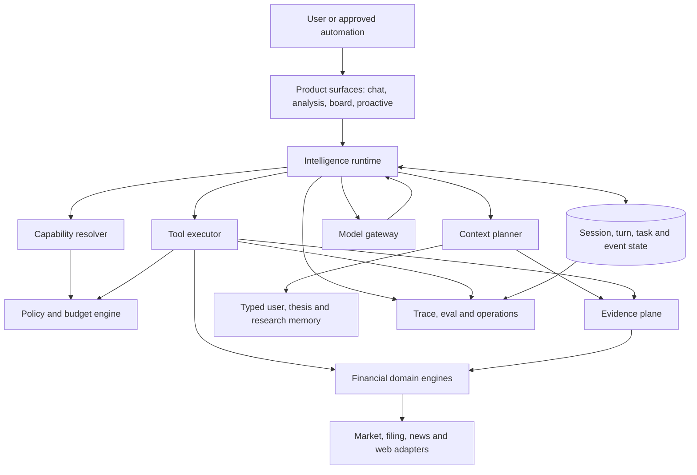

# Target architecture for the Investment Intelligence harness

Kiến trúc đích là một AI runtime tài chính có state bền, capability plane thống
nhất và evidence plane typed. Model điều phối và tổng hợp; deep modules hấp thụ
provider quirks, data semantics, policy, budget và persistence. Thiết kế học
boundary của OpenCode và production discipline của Hermes nhưng không mang
coding-agent threat model vào sản phẩm.

## Architectural thesis

Harness phải tối ưu đồng thời bốn thuộc tính. Không thuộc tính nào được mua bằng
cách phá thuộc tính còn lại.

- **Intelligence depth:** model có đủ context và capability để nghiên cứu nhiều
  bước, so sánh giả thuyết và tạo scenario.
- **Financial truth:** mọi claim trọng yếu quay về evidence point-in-time có
  provenance, unit, quality và uncertainty.
- **Operational control:** turn, call, retry, cost, deadline, cancellation và
  side effect đều bounded và audit được.
- **Evolution speed:** capability mới đi qua một interface chung, không tạo loop,
  policy, telemetry hoặc UI path riêng.

Kiến trúc không chọn “single agent” hay “multi-agent” làm identity. Nó chọn một
runtime chung; agent profile, specialist và background goal chỉ là policy bundle
chạy trên cùng protocol.

## System map

Sơ đồ mô tả dependency direction. Client không gọi model hoặc data provider
trực tiếp; model không đọc store ngoài capability plane.



## Deep modules and seams

Mỗi module dưới đây phải có interface nhỏ, che phần implementation phức tạp và
là test surface chính. “Owner hiện tại” chỉ là điểm vào để điều hướng; target
không yêu cầu đổi tên file nếu seam đã đủ sâu.

| Deep module | Interface mà caller cần biết | Complexity module phải giấu | Owner hiện tại gần nhất | Trạng thái |
|---|---|---|---|---|
| Intelligence runtime | Nhận task có identity/scope, trả durable outcome/events | loop, continuation, retry, cancel, finalization | `apps/api/src/agent/turns.py`, `apps/api/src/agent/loop.py`, `apps/api/src/alpha/analysis_loop.py` | **Target** hợp nhất invariant, không buộc hợp nhất lane |
| Session state | Thread/turn/task lifecycle và ordered parts | persistence, sequence, reconnect, orphan settlement | `apps/api/src/agent/persistence.py`, `apps/api/src/agent/turns.py`, `apps/api/src/agent/events.py` | **Current**, cần typed task/part depth hơn |
| Context planner | Dựng context trong budget cho task hiện tại | selection, cache tiers, deterministic prune, summary, recall | `apps/api/src/agent/messages.py`, `apps/api/src/agent/prompt/` | **Target** |
| Capability resolver | Trả capability surface đã resolve cho identity/lane/model | schema, availability, policy class, provenance, display, concurrency | `apps/api/src/agent/registry.py`, `apps/api/src/agent/toolsets.py`, `apps/api/src/agent/definitions.py` | **Current** nền, cần declaration đầy đủ hơn |
| Tool executor | Mỗi call có đúng một settled result | parse, barrier, timeout, guardrail, trace, output budget | `apps/api/src/agent/executor.py`, `apps/api/src/agent/guardrails.py` | **Current** |
| Evidence plane | Resolve evidence identity/as-of và claim support | source conflict, quality, lineage, retrieval, evidence graph | `apps/api/src/alpha/envelope.py`, `apps/api/src/stocks/signals/`, `apps/api/src/agent/tools/signals.py` | **Target** mở rộng |
| Financial engines | Trả deterministic metric/scenario với contract | market rules, methods, samples, uncertainty, point-in-time joins | `apps/api/src/stocks/signals/`, `apps/api/src/alpha/field_profile.py` | **Current** một phần |
| Model gateway | Normalized completion/stream hoặc typed failure | provider wire shape, cache, routing, breaker, recovery, pricing | `apps/api/src/core/llm/` | **Current** |
| Policy and budget | Quyết định capability/action có được chạy | auth, data scope, risk class, spend, deadlines, approval | `apps/api/src/agent/budget.py`, `apps/api/src/core/llm/admission.py`, `apps/api/src/agent/untrusted.py` | **Current** một phần |
| Memory | Typed context có provenance và lifecycle | preference, thesis, recall, retention, contradiction | `agent/tools/memory.py`, persistence owners | **Target** |
| Quality observer | Tính metric từ outcome và trace | eval datasets, graders, redaction, aggregation, drift | `apps/api/src/agent/ops.py`, `apps/api/src/alpha/analysis_reads.py` | **Target**; eval gate đang thiếu |

Một seam chỉ được tạo khi có variation thật hoặc test adapter thật. Không tạo
port chỉ để đổi tên một call chain; sâu hóa cluster khi complexity nếu xóa module
sẽ tràn ngược ra nhiều caller.

## Runtime lanes

Một harness chung không có nghĩa mọi task dùng cùng prompt, toolset, deadline
hoặc durability. Lane là policy profile trên cùng protocol, không phải một loop
không liên quan.

| Lane | Outcome | Context và capability | Durability |
|---|---|---|---|
| Conversation | Trả lời, research artifact hoặc clarification | user/thread memory + read-only evidence/web | turn bền, stream và reconnect |
| Symbol analysis | Analysis point-in-time theo profile | symbol/day cố định + evidence fields | analysis run và tool trace bền |
| Portfolio intelligence | Exposure, scenario và decision support | holdings snapshot + cross-asset evidence + risk engines | versioned portfolio study |
| Proactive monitor | Material change, thesis break hoặc scheduled brief | standing goal + last checkpoint + new evidence only | durable job, dedupe và delivery state |
| Evaluation | Outcome/trajectory score | frozen dataset + deterministic environment | immutable run artifact |

**Target invariant:** lane có thể khác control flow nhưng phải dùng chung model
gateway, capability declaration, executor protocol, evidence identity, policy,
budget taxonomy và observer schema. Không parameterize một loop đến mức interface
trở thành toàn bộ implementation; chia orchestrator khi lifecycle thực sự khác.

## Turn and task lifecycle

Runtime sở hữu protocol repair quanh model. Model output là đề xuất transition,
không phải state transition đã hoàn tất.

```text
accepted
  -> admitted
  -> context_ready
  -> model_running
  -> tool_planned
  -> tool_running
  -> tool_settled
  -> model_running ...
  -> completed | incomplete | refused | cancelled | failed
```

Các invariant bắt buộc là:

1. Persist intent/identity trước external effect hoặc model spend.
2. Chỉ một active owner điều phối một turn/task tại một thời điểm.
3. Mỗi tool call ID settle đúng một result: completed, error, blocked,
   interrupted hoặc unknown.
4. Result order phản ánh call order dù read-only execution chạy song song.
5. Unknown capability và unknown mutability mặc định conservative.
6. Cancellation truyền xuống model/tool/child và terminal state luôn được ghi.
7. Retry không xóa attempt cũ; typed cause quyết định bounded recovery.
8. Context overflow thay input; output cap thay reserve; rate limit chờ hoặc
   đổi route; auth và policy không retry mù.
9. Hết tool budget vẫn dành đường kết luận hoặc concrete blocker.
10. Trace failure không làm mất answer, nhưng answer failure không được ghi là
    success chỉ vì trace tồn tại.

`apps/api/src/agent/executor.py` và `apps/api/src/agent/loop.py` hiện đã bảo vệ
nhiều invariant này. Hướng
đích là làm lifecycle explicit trong durable state thay vì bắt UI hoặc ops suy
ra từ prose/event rời.

## Capability plane

Capability plane là interface duy nhất giữa model và thế giới. Built-in tool,
domain calculation, provider read, specialist agent và MCP tương lai đều phải
đi qua cùng declaration và execution policy.

Một resolved capability phải mang tối thiểu:

- model-facing name, description và strict input schema;
- human-facing label và display projection;
- availability/capability probe;
- read/write và idempotency class;
- internal, external hoặc mixed provenance;
- data sensitivity và authorization scope;
- concurrency/ordering class;
- deadline, output budget và artifact policy;
- approval requirement;
- handler/adapter identity và contract version.

`apps/api/src/agent/registry.py` đã đồng sở hữu schema, handler, availability,
display và
provenance. **Target:** loại bỏ mọi bảng tên song song còn lại bằng cách để
executor, context, trace, budget và UI projection đọc một resolved declaration.

### Tool design rules

Tool là Agent-Computer Interface của domain. Chất lượng schema, routing và
result contract phải được eval như model quality.

- Ưu tiên tool nhỏ theo ý định tài chính, không expose bảng hoặc provider raw.
- Đưa trusted identity, symbol và as-of qua `ToolContext`, không để model tự
  chọn ngoài scope đã cấp.
- Trả structured result có evidence identity, health và refusal reason.
- Giữ full result ở artifact/evidence store; context nhận preview và handle khi
  payload lớn.
- Song song read độc lập; serialize write, conflict hoặc unknown effect.
- Không retry write nếu thiếu idempotency/reconcile contract.
- Tool failure là result model-visible đã sanitize, không là transcript hole.
- Tool description phải nêu khi dùng và khi không dùng, không nhét business
  policy chỉ tồn tại trong prose.

## Evidence plane

Evidence plane là khác biệt quyết định giữa general agent harness và Investment
Intelligence harness. Nó không chỉ là vector search hoặc tool output cache; nó
là graph có thể truy ngược từ judgment đến source point-in-time.

Các node logic gồm observation, derived metric, document/event, claim,
hypothesis, scenario và judgment. Các edge logic gồm derived-from, supports,
contradicts, supersedes, compares-with và invalidates. Implementation có thể bắt
đầu bằng relational IDs và JSON contract; không cần graph database để giữ
semantic này.

Evidence plane phải cung cấp bốn operation ở seam:

- resolve evidence đúng entity/as-of/scope;
- compute hoặc retrieve derived metric qua deterministic engine;
- attach evidence references vào claim/outcome;
- audit lineage, conflict và quality sau khi turn kết thúc.

Model không trực tiếp mutate observation hoặc derived metric. Nó có thể đề xuất
claim/hypothesis/scenario; validator bảo đảm referenced evidence tồn tại, đúng
scope và không bị refused. Evidence bị stale không tự biến mất—health phải đi
cùng để model diễn giải.

## Context architecture

Context planner chọn đúng information cho task trước khi nghĩ đến compression.
Nó phải tối ưu task success trên một budget, không tối ưu token reduction riêng.

| Layer | Nội dung | Vòng đời | Trust |
|---|---|---|---|
| Stable contract | identity, safety, semantic rules, tool guidance | versioned, cache-friendly | privileged, repository-owned |
| Scoped product context | lane, user objective, symbol/portfolio/task scope | per task/session | typed and authorized |
| Capability catalog | resolved tool/skill summaries | per step khi availability đổi | repository/provider metadata |
| Evidence working set | observations, figures, documents, conflicts | per research plan | mixed; provenance required |
| Conversation/task state | intent, prior decisions, unresolved questions | durable, selected per turn | user and system content |
| Memory | preference, thesis, saved fact, prior outcome | cross-session with lifecycle | typed; user-scoped |
| Volatile runtime | current time, route, budgets, transient status | per call | system-owned |

Thứ tự giảm context pressure là:

1. chọn đúng thread/task/evidence;
2. loại duplicate và representation thừa một cách deterministic;
3. thay old large result bằng evidence handle và preview;
4. bảo vệ recent intent, cited evidence và unresolved commitments;
5. dùng lossy summary có provenance chỉ khi vẫn vượt;
6. cho phép recovery search quay lại full artifact.

Hermes cho stable/context/volatile cache discipline; OpenCode cho lazy rules,
progressive skills và deterministic prune. Stock_Massive dùng cả hai invariant,
nhưng privileged free-text memory và remote instruction không được nhập vào
stable contract.

## Memory and thesis lifecycle

Memory phải tăng continuity mà không tạo một system prompt tự sửa. Mỗi memory
record cần type, owner, provenance, confidence và lifecycle.

Các loại target gồm:

- user preference và constraint do người dùng xác nhận;
- watchlist rationale;
- investment thesis và falsifiers;
- open research question;
- prior judgment kèm evidence/as-of;
- interaction preference không nhạy cảm;
- derived summary có link về source turns.

Model có thể đề xuất ghi nhớ; deterministic policy quyết định scope và retention,
và người dùng có thể xem/xóa/sửa. New evidence có thể contradict memory nhưng
không được âm thầm rewrite lịch sử. Thesis tiến hóa bằng version mới và relation
`supersedes` hoặc `contradicts`.

## Model gateway and routing

Model gateway là seam duy nhất hiểu provider wire format. Runtime chỉ nhận
normalized stream/completion, usage và typed failure.

Routing phải dựa trên workload contract, không chỉ tên model:

- capability support: tools, structured output, context/cache, multimodal;
- quality tier đã chứng minh trên eval lane tương ứng;
- latency và cost envelope;
- data residency/privacy requirement;
- current route health và failure scope;
- fallback semantic compatibility.

Không cần hỗ trợ mọi provider. Hai adapter production/test hoặc hai route có
giá trị thật mới biện minh cho seam mở rộng. Fallback chỉ hợp lệ nếu tool schema,
structured output và context semantics còn đạt contract; route sống nhưng làm
mất evidence contract không phải recovery thành công.

## Specialist and subagent architecture

Specialist là capability conditional, không là mặc định của mọi answer. Một
specialist dùng cùng runtime với profile khác về prompt, model, tool allowlist,
budget và output schema.

Delegation chỉ mở khi task có thể chia độc lập và uplift đã được đo. Contract
bắt buộc gồm:

- fresh context và self-contained assignment;
- explicit evidence/time scope;
- monotonic authorization: child không tăng data/action permission;
- typed output gồm findings, evidence references, confidence và blockers;
- depth, child count, global token/cost/deadline cap;
- cancellation, durable status và deterministic join;
- parent không duplicate phần đã giao;
- full child trace audit được nhưng không mặc định đẩy vào parent context.

Các specialist tài chính tiềm năng là evidence collector, fundamental analyst,
market/microstructure analyst, event analyst, portfolio/risk analyst và
skeptical verifier. Đây là role logic, không mặc định là sáu model call. Runtime
có thể chạy role inline, bằng deterministic engine hoặc bằng child tùy task.

## Proactive and long-running intelligence

Proactive work cần durable task runner, không kéo dài một HTTP turn hoặc dùng
cron prompt không có checkpoint. Standing goal phải chỉ rõ scope, trigger,
materiality, budget, expiry và delivery policy.

Một proactive task phải có:

- stable goal version và owner;
- last evaluated checkpoint;
- idempotent evidence window;
- dedupe/materiality decision;
- bounded research plan;
- delivery status và retry policy;
- user-visible pause/delete controls;
- no automatic escalation từ monitor sang financial execution.

Chỉ persist state đủ để resume từ checkpoint đã xác nhận. Exactly-once external
effect cần idempotency hoặc reconciliation; event log đơn lẻ không tạo ra tính
chất đó.

## Observability architecture

State, events, telemetry và trajectory là bốn surface khác nhau. Không dùng một
blob transcript cho cả UI, billing, eval và incident response.

- Durable state sở hữu truth của session/turn/task/tool.
- Product events là projection versioned cho client và reconnect.
- Operational telemetry mặc định content-light, metric/span có cardinality
  bounded.
- Evaluation trajectory là artifact opt-in, redacted, access-controlled và có
  retention.

Mọi event phải liên kết được root task, parent task, model attempt, tool call,
evidence IDs và terminal outcome mà không cần lưu chain-of-thought. Thought UI
không phải audit proof; decision/evidence trace mới là proof.

## Dependency rules

Các rule này bảo vệ locality khi capability tăng.

1. Product surface phụ thuộc runtime contract, không phụ thuộc provider/tool.
2. Runtime phụ thuộc interfaces của context, capability, model, state và policy,
   không phụ thuộc domain adapter cụ thể.
3. Model gateway không biết business semantics hoặc UI.
4. Tool executor không biết tên tool cụ thể.
5. Domain engines không gọi model để hoàn thành deterministic calculation.
6. Evidence plane không tin text answer để suy ngược provenance.
7. Policy không nằm trong prompt như owner duy nhất.
8. Observer không thay đổi outcome; instrumentation failure degrade-open có log.
9. Subagent không có alternate execution path bỏ qua capability/policy plane.
10. Research docs không được import thành runtime instruction đặc quyền.

## Adopt, adapt and reject

Hai harness tham khảo được dùng như evidence cho quyết định, không là kiến trúc
cha của Stock_Massive.

| Pattern | Quyết định | Lý do |
|---|---|---|
| OpenCode server/session separation | **Adapt** | FastAPI/SSE đã là server; lấy durable typed state và shared contract |
| OpenCode resolved capability plane | **Adopt** | Giảm bypass path và declaration drift |
| OpenCode typed tool lifecycle | **Adopt** | Cần cho replay, orphan settlement và UI consistency |
| OpenCode host shell/plugin/MCP breadth | **Reject** | Không tạo investment outcome tương xứng threat surface |
| Hermes recovery taxonomy | **Adopt** | Failure cause phải map bounded action |
| Hermes stable/context/volatile prompt | **Adapt** | Giữ cache, nhưng typed user/evidence context thay free-text privileged memory |
| Hermes output spill + turn budget | **Adopt** | Context cần preview/handle và aggregate bound |
| Hermes guardrail decision ladder | **Current/adopt** | Stock đã có ladder sâu và one-result invariant |
| Hermes in-process subagent tree | **Reject as target** | Thiếu durable resume và global budget |
| General graph framework rewrite | **Reject now** | Chưa có failure yêu cầu thay toàn runtime; sâu hóa seams hiện tại trước |

## Migration posture

Target architecture được đạt bằng deepening có kiểm chứng, không bằng rewrite.
Mỗi phase thay một seam và giữ observable contract qua tests/evals.

- Giữ `AgentLoop`, Analysis loop và SSE behavior khi dựng capability/evidence
  interfaces chung.
- Thêm typed durable state trước khi yêu cầu resume hoặc background worker.
- Instrument context/eval trước khi thêm compaction hoặc specialist.
- Chỉ xóa owner cũ sau khi caller và tests đi qua deep module mới; không layer
  pass-through vĩnh viễn.
- Không đổi public contract chỉ để giống tên gọi của Hermes/OpenCode.

## Câu hỏi chưa giải quyết

Các seam sau cần evidence implementation trước khi khóa hình dạng chi tiết.

- Durable state nên sâu đến typed message parts hay chỉ task/tool transitions
  cộng evidence references đã đủ cho product UX?
- Evidence graph nên nằm hoàn toàn trong relational schema hiện tại hay cần
  artifact/index riêng cho document-level claims?
- Conversation và Analysis có nên hội tụ một runtime implementation hay chỉ
  chia sẻ deep modules bên dưới orchestrator?
- Proactive runner dùng scheduler hiện tại, queue Postgres hay runtime durable
  ngoài process khi workload được chứng minh?
