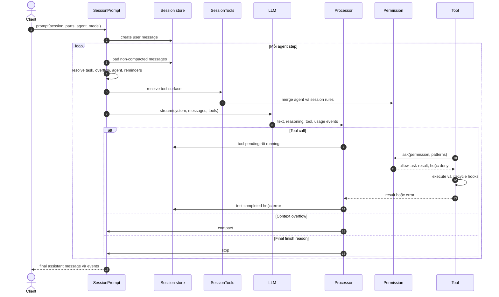

# OpenCode — agent loop và vòng đời tool call

Vòng lặp của OpenCode là một state machine bền quanh model stream. Nó dựng
context và tool surface cho từng step, stream event vào processor, ghi từng part,
rồi quyết định `continue`, `compact`, hoặc `stop`. Tool execution xảy ra bên
trong stream của AI runtime, nhưng state và policy thuộc OpenCode.

## Một turn đầy đủ

Sơ đồ được rút trực tiếp từ
[`session/prompt.ts`](https://github.com/anomalyco/opencode/blob/3a31c4ea801915c0b050df4b3842997ea62b6e93/packages/opencode/src/session/prompt.ts),
[`session/processor.ts`](https://github.com/anomalyco/opencode/blob/3a31c4ea801915c0b050df4b3842997ea62b6e93/packages/opencode/src/session/processor.ts),
và
[`session/tools.ts`](https://github.com/anomalyco/opencode/blob/3a31c4ea801915c0b050df4b3842997ea62b6e93/packages/opencode/src/session/tools.ts).



## Loop invariant

`runLoop()` mỗi vòng làm theo thứ tự sau:

1. Đọc transcript đã lọc các vùng compacted.
2. Dừng nếu assistant cuối có finish reason cuối cùng và không còn tool call hợp
   lệ cần trả kết quả.
3. Xử lý task nội bộ như subtask hoặc compaction trước model call thường.
4. Kiểm tra usage thật của step trước có vượt window model hay không.
5. Resolve agent, step budget, reminders, tool surface, system instructions, và
   model messages.
6. Stream qua processor.
7. Chuyển kết quả processor thành `stop`, `compact`, hoặc `continue`.

**Đã kiểm chứng:** OpenCode còn xử lý provider trả finish reason `stop` dù message
có tool call. Loop nhìn vào typed tool parts và tiếp tục để trả tool results cho
model, thay vì tin mù vào finish reason. Owner là
[`session/prompt.ts`](https://github.com/anomalyco/opencode/blob/3a31c4ea801915c0b050df4b3842997ea62b6e93/packages/opencode/src/session/prompt.ts).

## Processor là nơi bảo toàn tool state

Processor pre-capture workspace snapshot trước khi stream bắt đầu vì AI SDK có
thể execute tool trước event `step-start`. Nó giữ map `toolCallID → part`, rồi
chuẩn hóa các transition:

```text
pending → running → completed
                  ↘ error
                  ↘ interrupted error
```

Khi stream cleanup, processor chờ tool đang chạy trong một khoảng ngắn, sau đó
đánh dấu tool chưa settle là interrupted. Nhờ vậy transcript không có tool call
mồ côi ở trạng thái chạy vô hạn. Source owner là
[`session/processor.ts`](https://github.com/anomalyco/opencode/blob/3a31c4ea801915c0b050df4b3842997ea62b6e93/packages/opencode/src/session/processor.ts).

## Tool surface được dựng lại theo agent và model

`SessionTools.resolve()` không trả một registry tĩnh. Nó:

- hỏi registry danh sách tool phù hợp với model, provider, agent, và permission;
- transform JSON Schema theo quirks của model;
- gắn `AbortSignal`, session, message, call ID, metadata callback, và permission
  callback vào `Tool.Context`;
- chạy `tool.execute.before` và `tool.execute.after` hooks;
- thêm MCP resource tools khi server khai capability tương ứng;
- hợp nhất MCP tools vào cùng namespace và policy surface.

**Suy luận:** đây là một trong các quyết định tốt nhất của OpenCode. Capability
discovery xảy ra gần call boundary, nên agent profile, provider schema, plugin,
MCP availability, và session override không tạo nhiều tool loop khác nhau.

## Permission là last-match-wins policy

Mỗi request permission gồm `permission`, một hoặc nhiều `patterns`, metadata,
và các pattern có thể nhớ khi người dùng chọn “always”. Evaluator flatten rules
rồi lấy rule khớp cuối cùng; nếu không có rule, mặc định là `ask`. Một request có
bất kỳ pattern `deny` nào bị từ chối; pattern `ask` tạo deferred request và event
cho client. Owner là
[`permission/index.ts`](https://github.com/anomalyco/opencode/blob/3a31c4ea801915c0b050df4b3842997ea62b6e93/packages/opencode/src/permission/index.ts)
và [Permissions](https://opencode.ai/docs/permissions/).

Điểm quan trọng:

- `edit` gate chung cho `edit`, `write`, và `apply_patch`.
- `external_directory` là boundary riêng ngoài worktree.
- MCP tool names cũng match wildcard trong permission plane.
- Session rules được merge sau agent rules, nên override cục bộ có thể thắng.
- “Always” chỉ thêm allow rule vào state permission của instance hiện tại.

Permission không chứng minh command an toàn; nó chỉ chứng minh policy đã cho
phép hoặc người dùng đã phê duyệt.

## Doom-loop detection

Processor lấy các part gần nhất và nếu đủ một ngưỡng toàn là cùng tool với cùng
JSON input, nó yêu cầu permission `doom_loop`. Đây là guard tương tác, không tự
động kết luận call sai. Agent mặc định đặt `doom_loop: ask`, vì vậy người dùng
có thể cho tiếp tục hoặc dừng vòng lặp. Source owner là
[`session/processor.ts`](https://github.com/anomalyco/opencode/blob/3a31c4ea801915c0b050df4b3842997ea62b6e93/packages/opencode/src/session/processor.ts)
và
[`agent/agent.ts`](https://github.com/anomalyco/opencode/blob/3a31c4ea801915c0b050df4b3842997ea62b6e93/packages/opencode/src/agent/agent.ts).

**So với Stock_Massive:** OpenCode nhận diện lặp bằng đúng tool + input ở cửa
stream, còn `apps/api/src/agent/guardrails.py` có thang
`allow → warn → block → halt`, phân biệt repeated failure và no-progress bằng
hash kết quả. Harness của ta sâu hơn về policy lặp; OpenCode sâu hơn về UI
approval và durable tool-part lifecycle.

## Retry taxonomy

`session/retry.ts` retry tối đa hữu hạn, ưu tiên `Retry-After` header, nếu không
dùng exponential backoff có jitter và trần. Nó nhận diện HTTP 5xx, 429, network
failure, timeout, overload, và một số provider usage-limit shape; context
overflow bị loại khỏi retry vì remedy là compaction. Owner là
[`session/retry.ts`](https://github.com/anomalyco/opencode/blob/3a31c4ea801915c0b050df4b3842997ea62b6e93/packages/opencode/src/session/retry.ts).

**Đánh giá:** policy này tốt hơn retry mù, nhưng taxonomy vẫn dựa nhiều vào
regex/message và chưa mô hình hóa failure scope chi tiết như credential versus
endpoint versus model deployment. Không nên gọi đây là SOTA error routing nếu
không có benchmark hay incident evidence công khai.

## Output và context pressure

Tool output lớn được cắt theo line/byte, bản đầy đủ lưu ở truncation directory,
và hint hướng model dùng search/read có offset hoặc giao explore agent xử lý.
Output cũ còn được compaction prune theo token pressure. Owner là
[`tool/truncate.ts`](https://github.com/anomalyco/opencode/blob/3a31c4ea801915c0b050df4b3842997ea62b6e93/packages/opencode/src/tool/truncate.ts)
và
[`session/compaction.ts`](https://github.com/anomalyco/opencode/blob/3a31c4ea801915c0b050df4b3842997ea62b6e93/packages/opencode/src/session/compaction.ts).

Best practice rút ra không phải “truncate mọi thứ”, mà là:

- giữ full artifact ngoài prompt;
- trả preview có định hướng truy hồi;
- bảo vệ một số tool result giàu instruction như `skill`;
- compact ở boundary turn, không phá cặp tool call/result;
- dùng usage thật của provider làm backstop cho ước lượng.

## Các failure path đáng học

- Provider finish `stop` nhưng còn tool call → tiếp tục loop.
- Tool bị abort sau khi đã tạo part → complete hoặc đánh dấu interrupted.
- Content filter trả finish reason → surface thành typed error, không idle im
  lặng.
- Structured output không xuất hiện → typed error, không giả JSON rỗng.
- Context overflow → compact, không retry nguyên request.
- Permission rejection → stop hoặc tiếp tục tùy flag, nhưng tool part vẫn có
  error result.
- Step budget hết → chèn max-step prompt để model kết luận thay vì gọi thêm.

Các nhánh này cho thấy harness production phải sở hữu **protocol repair** quanh
model, không chỉ sở hữu prompt.
