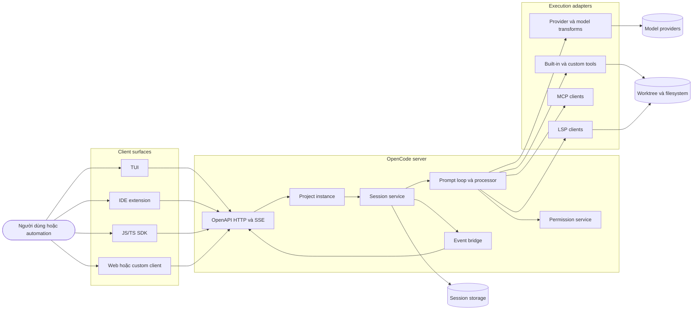

# OpenCode — kiến trúc hệ thống

OpenCode tổ chức harness theo mô hình client/server cục bộ: giao diện gửi lệnh
vào một HTTP server, server quản lý project instance và session, session loop gọi
provider qua một adapter, còn tool runtime thực thi action rồi phát event trở
lại. Cách chia này làm cho TUI, IDE, SDK, và headless automation dùng cùng một
contract.

## Snapshot khảo sát

Các nhận định dưới đây được kiểm chứng tại commit
[`3a31c4e`](https://github.com/anomalyco/opencode/tree/3a31c4ea801915c0b050df4b3842997ea62b6e93).
Owner quan trọng nhất là
[`packages/opencode/src/session`](https://github.com/anomalyco/opencode/tree/3a31c4ea801915c0b050df4b3842997ea62b6e93/packages/opencode/src/session),
không phải package TUI. Snapshot `dev` này đi sau release `v1.18.21`; tài liệu
không gán behavior chỉ có trên `dev` cho release đó.

## Hai thế hệ session runtime

OpenCode đang giữ hai đường kiến trúc song song. Đây là boundary quan trọng nhất
khi đọc source hiện tại.

| Concern | V1 đang vận hành | V2 đang chuyển tiếp |
|---|---|---|
| Orchestrator | `session/prompt.ts` | `core/session/runner/llm.ts` |
| Stream normalization | `session/processor.ts` | `publish-llm-event.ts` |
| Durable state | Session/message/part tables và events | Append event log và projector |
| Tool settlement | Processor quản typed parts | Persist call trước side effect, settle qua fibers |
| Per-session concurrency | Running state của prompt loop | Run coordinator với one-owner/coalesced wake |
| Maturity | Đường chức năng đầy đủ | Source tự liệt kê nhiều parity item chưa xong |

**Đã kiểm chứng:** V2 có `SessionEvent`, projector, và run coordinator serialize
một active drain trên mỗi session. Runner tự ghi checklist chưa hoàn tất cho
distributed ownership, bounded retries/repeated calls, MCP/plugin parity,
cancellation settlement, và post-run maintenance. Xem
[`core/session/runner/llm.ts`](https://github.com/anomalyco/opencode/blob/3a31c4ea801915c0b050df4b3842997ea62b6e93/packages/core/src/session/runner/llm.ts#L43-L90),
[`core/session/projector.ts`](https://github.com/anomalyco/opencode/blob/3a31c4ea801915c0b050df4b3842997ea62b6e93/packages/core/src/session/projector.ts#L111-L208),
và
[`core/session/run-coordinator.ts`](https://github.com/anomalyco/opencode/blob/3a31c4ea801915c0b050df4b3842997ea62b6e93/packages/core/src/session/run-coordinator.ts#L5-L104).

**Suy luận:** persist-intent-before-effect và projection là nền tốt cho replay,
nhưng không tự tạo exactly-once side effect. Crash giữa “called” và “settled”
vẫn cần idempotency hoặc reconcile contract. Vì V2 chưa parity, các phần còn lại
của hồ sơ mô tả V1 trừ khi ghi rõ V2.

## Boundary cấp hệ thống

Sơ đồ này mô tả dependency direction, không mô tả deployment bắt buộc. TUI có
thể khởi động server trong cùng process tree, còn `opencode serve` chạy server
headless độc lập.

**Đã kiểm chứng:** official docs nói rõ khi chạy `opencode`, TUI nói chuyện với
server; server công bố OpenAPI 3.1 và cùng spec sinh SDK. Xem
[Server](https://opencode.ai/docs/server/) và
[SDK](https://opencode.ai/docs/sdk/).

## Sáu lớp có owner rõ ràng

| Lớp | Owner | Trách nhiệm kiến trúc |
|---|---|---|
| Transport | [`server/server.ts`](https://github.com/anomalyco/opencode/blob/3a31c4ea801915c0b050df4b3842997ea62b6e93/packages/opencode/src/server/server.ts) | HTTP/OpenAPI, auth, CORS, route composition |
| Project runtime | [`project/instance-runtime.ts`](https://github.com/anomalyco/opencode/blob/3a31c4ea801915c0b050df4b3842997ea62b6e93/packages/opencode/src/project/instance-runtime.ts) | Cô lập service state theo directory/worktree |
| Durable conversation | [`session/session.ts`](https://github.com/anomalyco/opencode/blob/3a31c4ea801915c0b050df4b3842997ea62b6e93/packages/opencode/src/session/session.ts), [`message-v2.ts`](https://github.com/anomalyco/opencode/blob/3a31c4ea801915c0b050df4b3842997ea62b6e93/packages/opencode/src/session/message-v2.ts) | Session, message, typed part, parent/child lineage |
| Agent runtime | [`session/prompt.ts`](https://github.com/anomalyco/opencode/blob/3a31c4ea801915c0b050df4b3842997ea62b6e93/packages/opencode/src/session/prompt.ts), [`processor.ts`](https://github.com/anomalyco/opencode/blob/3a31c4ea801915c0b050df4b3842997ea62b6e93/packages/opencode/src/session/processor.ts) | Loop, stream consumption, tool state, stop/retry/compact |
| Capability layer | [`session/tools.ts`](https://github.com/anomalyco/opencode/blob/3a31c4ea801915c0b050df4b3842997ea62b6e93/packages/opencode/src/session/tools.ts), [`tool/registry.ts`](https://github.com/anomalyco/opencode/blob/3a31c4ea801915c0b050df4b3842997ea62b6e93/packages/opencode/src/tool/registry.ts) | Resolve tool theo model/agent, schema adaptation, execution hooks |
| Model abstraction | [`provider/provider.ts`](https://github.com/anomalyco/opencode/blob/3a31c4ea801915c0b050df4b3842997ea62b6e93/packages/opencode/src/provider/provider.ts), [`provider/transform.ts`](https://github.com/anomalyco/opencode/blob/3a31c4ea801915c0b050df4b3842997ea62b6e93/packages/opencode/src/provider/transform.ts) | Provider discovery, auth, model metadata, request/schema/message quirks |

Đây là “deep modules”: mỗi concern có một service owner, nhưng các service nối
nhau qua typed Effect layers và event schemas. Việc dùng Effect làm lifecycle,
dependency injection, cancellation, retry, scoped finalizer, và concurrency
primitive là một lựa chọn kiến trúc xuyên suốt, không phải helper cục bộ.

## V1 session là durable record ở mức part

Message không chỉ có `role` và `content`. Assistant message gồm nhiều typed part:
text, reasoning, tool state, step start/finish, snapshot, compaction, file, patch,
và metadata. Processor cập nhật part khi stream chuyển từ tool input sang
`running`, `completed`, hoặc `error`; UI quan sát cùng state qua event bridge.
Owner là
[`message-v2.ts`](https://github.com/anomalyco/opencode/blob/3a31c4ea801915c0b050df4b3842997ea62b6e93/packages/opencode/src/session/message-v2.ts)
và
[`processor.ts`](https://github.com/anomalyco/opencode/blob/3a31c4ea801915c0b050df4b3842997ea62b6e93/packages/opencode/src/session/processor.ts).

**Suy luận:** V1 gần event sourcing nhưng không nên gọi là event sourcing đầy
đủ. Durable truth vẫn là bảng message/part; event stream là projection cho
client, không phải log duy nhất dùng để rebuild toàn hệ thống. V2 mới là đường
đang đưa append event và projector thành primitive lõi.

## Provider portability có giá thật

OpenCode không dừng ở interface `generate()`. Nó giữ một lớp transform lớn để
chuẩn hóa schema tool, system message, reasoning block, cache hint, token limit,
finish reason, và lỗi theo model/provider. LLM runtime còn có seam thử nghiệm để
chọn native runtime hoặc fallback về AI SDK. Xem
[`session/llm.ts`](https://github.com/anomalyco/opencode/blob/3a31c4ea801915c0b050df4b3842997ea62b6e93/packages/opencode/src/session/llm.ts)
và
[`provider/transform.ts`](https://github.com/anomalyco/opencode/blob/3a31c4ea801915c0b050df4b3842997ea62b6e93/packages/opencode/src/provider/transform.ts).

**Trade-off:** portability không miễn phí. Provider layer là một trong các vùng
lớn và dễ drift nhất; mỗi model family kéo thêm nhánh tương thích. Đây là lý do
Stock_Massive chỉ nên port invariant và taxonomy, không port cả adapter surface.

## Extension surface

OpenCode có ba kiểu mở rộng khác nhau:

- **Plugin hook:** can thiệp trước/sau tool, transform message, compaction,
  shell environment, event, auth, và config. Official owner là
  [Plugins](https://opencode.ai/docs/plugins/).
- **Custom tool:** đăng ký capability mới vào cùng tool registry và permission
  plane. Official owner là
  [Custom tools](https://opencode.ai/docs/custom-tools/).
- **MCP:** kết nối tool, prompt, resource, và OAuth transport từ server ngoài.
  Owner là [`mcp/index.ts`](https://github.com/anomalyco/opencode/blob/3a31c4ea801915c0b050df4b3842997ea62b6e93/packages/opencode/src/mcp/index.ts)
  và [MCP servers](https://opencode.ai/docs/mcp-servers/).

Ba surface không bị trộn: plugin thay đổi runtime, custom tool chạy trong runtime,
còn MCP nối runtime tới capability ngoài process.

## Điểm mạnh và giới hạn

### Điểm mạnh

- Contract server-first giúp nhiều client dùng chung behavior.
- Typed message part làm streaming, replay, diff, abort, và UI inspection rõ.
- Scoped service state giảm singleton xuyên project/worktree.
- Permission, hooks, and observability nằm trên đường tool chung.
- Provider quirks có owner tập trung thay vì rải trong agent loop.

### Giới hạn

- Permission là policy gate, **không phải OS sandbox**. `bash` vẫn chạy trên host
  theo quyền của process nếu người dùng cho phép; so sánh với runtime container
  của OpenHands ở [đối chiếu SOTA](opencode-sota-comparison.md).
- Mặc định capability khá rộng: source built-in agent bắt đầu từ `"*":
  "allow"`, rồi yêu cầu approval cho external directory, `.env`, và doom loop.
  Owner là [`agent/agent.ts`](https://github.com/anomalyco/opencode/blob/3a31c4ea801915c0b050df4b3842997ea62b6e93/packages/opencode/src/agent/agent.ts).
- Plugin có thể sửa arguments trước tool execution; đó là sức mạnh và cũng là
  trust boundary. Plugin cục bộ hoặc npm phải được xem như code có quyền tương
  đương process OpenCode.
- Server standalone chỉ an toàn khi cấu hình auth và network boundary đúng;
  official docs mặc định bind `127.0.0.1` và hỗ trợ HTTP basic auth qua biến môi
  trường, không biến nó thành một multi-tenant control plane tự động.
