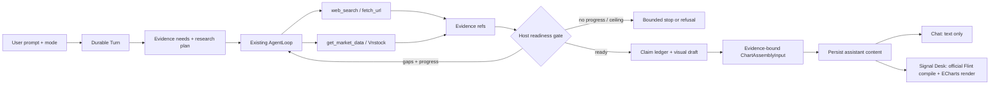

# Signal Desk Visual Research Harness

## Outcome

Trong mode `signal_desk`, một prompt chứng khoán tạo một durable Turn, tự lập
kế hoạch bằng chứng, tìm web, gọi Vnstock khi thiếu dữ liệu thị trường có cấu
trúc, kiểm tra readiness bằng code, rồi trả đồng thời:

1. câu trả lời text đã đi qua claim/evidence ledger trong Chat; và
2. một `ChartAssemblyInput` hợp lệ, lấy số chỉ từ evidence đã trace, được package
   Flint chính thức compile và ECharts render ở pane phải Signal Desk.

Agent được phép research sâu nhưng không được tự quyết định chạy vô hạn. Model
đề xuất evidence need, tool call và trạng thái ready; host giữ quyền cuối cùng
về permission, provenance, freshness, chart validity, budget và lý do dừng.

## Scope Decisions

| Decision | Chốt |
|---|---|
| Visual core | Chọn [Microsoft Flint](https://github.com/microsoft/flint-chart), pin release đã kiểm chứng; `lieflat-charts` chỉ là visual benchmark, không vào runtime. |
| Flint integrity | Không fork, patch, copy template, sửa compiler output hoặc hậu xử lý ECharts option. Host chỉ chuẩn bị input và style khung panel. |
| Demo | Dùng official `flint-chart-mcp` trước, chạy local với `--disable-file-reference` và ECharts backend; demo không trở thành production dependency. |
| Product integration | Dùng official `flint-chart` + ECharts trong web app; persist input, compile khi render, không persist generated ECharts option. |
| Agent architecture | Mở rộng `AgentLoop` hiện có; không tạo orchestrator, dispatcher, budget ledger hoặc state machine thứ hai. |
| Research source | `web_search`/`fetch_url` cho narrative và primary evidence; một tool `get_market_data` cho structured stock data. |
| Vnstock scope | Chỉ `ohlcv`, `quote`, `trades`, read-only, một mã/call, bounded rows; không indicator, Study DSL, stock store, scheduler, watchlist hay order execution. |
| Deployment | Vnstock Community chỉ bật ở profile personal/non-commercial internal. Production fail-closed cho tới khi có software license và quyền upstream bằng văn bản. |
| UI contract | Chat chỉ render text/claim/evidence; visual chỉ render ở pane phải Signal Desk. Mode `chat` không tạo visual artifact. |
| Readiness | Hybrid: model khai báo need/ready; deterministic host gate mới được kết thúc research và phát visual. |
| Bounds | Khởi đầu bằng lane deep hiện có: tối đa 10 tool rounds, 20 external calls, 1.800 giây; mọi model/tool/recovery call dùng chung envelope hiện có. |

## Architecture



No new path bypasses the current capability plane:

```text
model proposal
  → resolved tool surface
  → permission
  → per-Turn budget/deadline
  → TurnGuardrails
  → ToolExecutor
  → trace + evidence normalization
  → readiness coverage delta
```

## Bounded Readiness Contract

Each deep Signal Desk Turn carries a typed set of evidence needs. A need has an
ID, kind (`narrative`, `primary`, `structured_market`), materiality, expected
symbol/dataset/time range and evidence IDs that resolved it. The model may add
or refine needs, but cannot mark a need resolved without evidence already in the
Turn.

The host returns one of three readiness states:

- `continue`: at least one material gap remains and a legal, non-duplicate call
  can plausibly close it;
- `ready_answer`: material needs, temporal checks, provenance and visual data
  requirements pass;
- `ready_refusal`: further calls cannot close the gap within policy/bounds, so
  the truthful result is “không đủ bằng chứng”.

Finite stop reasons are persisted and exposed in progress: `ready`,
`cancelled`, `deadline`, `round_ceiling`, `external_call_ceiling`,
`spend_ceiling`, `permission_denied`, `provider_unavailable`, `no_progress`,
`invalid_visual`, and `insufficient_evidence`.

### Anti-loop invariants

- Exact calls use the existing canonical argument fingerprint. A successful
  exact repeat reuses the in-Turn result; it is not dispatched upstream twice.
- Existing repeated-failure `warn → block → halt` remains authoritative.
- Existing result SHA detects a call that returned the same payload.
- After every round, the host hashes resolved need IDs + evidence IDs + material
  gap IDs. First unchanged round emits course-correction guidance; the second
  consecutive unchanged round halts tools and forces synthesis/refusal.
- Blocked, malformed and permission-denied calls do not consume an external
  call, but they do consume loop progress and therefore cannot spin forever.
- No retry, format repair, verifier or Flint correction may create a nested
  unbudgeted loop. Every attempt consumes the same Turn envelope; at most one
  strict-format repair is allowed per artifact.
- The runtime does not start another research/tool call unless enough admitted
  capacity remains to settle the Turn. Missing verifier capacity yields the
  current typed incomplete reason, never an extra call outside the envelope.

## What Is Reused

- Hermes pattern: one result-aware model↔tool loop, bounded recovery, context
  pruning and explicit terminal reasons.
- OpenCode pattern: durable typed Turn state, resolved capability surface,
  permission and budget before dispatch.
- Oh My Pi pattern: checkpointed trajectory, course correction and full
  artifacts outside transient prompt context.
- Existing Stock_Massive runtime: `AgentLoop`, `LaneProfile`, `TurnGuardrails`,
  `ToolExecutor`, `TurnBudget`, claim ledger, typed progress, SSE replay,
  cancellation and terminal transaction.

Rejected: coding-agent shell/LSP/DAP surfaces, multi-agent delegation, a generic
MCP gateway, model-generated React/HTML, a second chart DSL and resurrecting the
retired Study/Board/widget stack.

## Delivery Phases

| # | Phase | Status | Effort | Dependency |
|---|---|---|---:|---|
| 1 | [Roadmap deviation and baseline](./phase-01-roadmap-deviation-and-baseline.md) | Todo | 6h | — |
| 2 | [Official Flint MCP demo](./phase-02-official-flint-mcp-demo.md) | Todo | 8h | 1 |
| 3 | [Vnstock market-data capability](./phase-03-vnstock-market-data-capability.md) | Todo | 20h | 1 |
| 4 | [Evidence-readiness agent loop](./phase-04-evidence-readiness-agent-loop.md) | Todo | 24h | 3 |
| 5 | [Flint visual-artifact core](./phase-05-flint-visual-artifact-core.md) | Todo | 20h | 2, 4 |
| 6 | [Signal Desk right panel](./phase-06-signal-desk-right-panel.md) | Todo | 20h | 5 |
| 7 | [End-to-end quality gate](./phase-07-end-to-end-quality-gate.md) | Todo | 16h | 6 |

Phases are sequential at the roadmap level. Phase 2 and 3 may be developed in
parallel only after Phase 1 is accepted because they do not share runtime files;
Phase 4 starts only after the market contract is fixed.

## Cross-phase File Inventory

| Surface | Existing owner | Planned change |
|---|---|---|
| Product authority | `CLAUDE.md`, `docs/roadmap.md` | Approve the narrow deviation before code. |
| Runtime loop | `apps/api/src/agent/loop.py`, `lanes.py`, `guardrails.py` | Typed readiness and finite no-progress settlement; no second loop. |
| Tool plane | `registry.py`, `toolsets.py`, `executor.py`, `tools/` | Register one bounded `get_market_data`. |
| Evidence | `apps/api/src/agent/evidence/` | Convert market rows to `STORE_FIGURE` evidence and bind visual values to IDs. |
| Durable message | `apps/api/src/agent/turns.py`, `persistence.py` | Add one optional versioned visual part to existing checkpoint/message JSON; no new artifact table. |
| Request contract | `apps/api/src/agent/schemas.py`, web API client | Add `mode: chat | signal_desk` atomically; default legacy requests to `chat`. |
| Visual runtime | `apps/web/src/lib/flint/`, `apps/web/package.json` | Thin official compile/validation wrapper only. |
| Right pane | `inspector.tsx`, `desk-state.tsx`, `components/signal-desk/` | Render latest Turn visual at existing `Body` seam. |
| Release evidence | API/web tests and `apps/api/golden/` | Combined text/evidence/visual corpus and bounded-loop adversarial cases. |

## Success Criteria

- [ ] Accepted roadmap deviation explicitly opens Signal Desk visual mode, one
      Vnstock read capability and the Flint integration; all other retired paths
      remain retired.
- [ ] A Signal Desk Turn can use web + Vnstock, settle durably, reopen after
      refresh and render the same Flint chart input without re-running research.
- [ ] Chat mode emits no visual part and the transcript never renders a chart.
- [ ] Every visual number resolves to a normalized market evidence value and
      every visual series names evidence IDs and `as_of` metadata.
- [ ] Official Flint package is unmodified; no generated ECharts option is
      persisted or post-processed.
- [ ] Duplicate/no-progress/failure adversarial tests prove no Turn exceeds 10
      rounds, 20 external calls or 1.800 seconds, and every exit has a reason.
- [ ] Vnstock is impossible to enable outside the personal internal profile;
      secrets never reach prompt, browser, trace or logs.
- [ ] Existing truth-contract hard gates stay green; the remaining Phase 6 paid
      quality gate is run once as part of the combined visual/evidence corpus.
- [ ] API focused/full suites, migration check if needed, web lint/type/test/build,
      `compileall`, `git diff --check` and retired-path scan pass.

## Risks And Rollback

| Risk | Containment | Rollback |
|---|---|---|
| Flint API/version drift | Pin exact package, compile fixtures in CI, upgrade only through canary. | Remove optional visual part and dependencies; text/evidence path remains. |
| Model emits plausible but invented chart values | Host hydrates datasets only from evidence IDs; reject literal data not present in trace. | Set visual status unavailable; never weaken ledger. |
| Vnstock schema/unit/time drift | Pin version, validate/post-filter, raw+normalized hashes, source-specific contract tests. | Disable `get_market_data`; web evidence remains. |
| Tool storm/infinite loop | Shared ceilings, duplicate cache, failure ladder, coverage-delta halt. | Revert readiness extension; existing bounded AgentLoop remains. |
| License/upstream rights | Internal-only runtime gate; production hard-disabled. | Uninstall optional provider and retain provider-neutral tool contract only if still used. |
| Legacy Signal plan conflicts | This plan blocks and supersedes remaining work; no Study/Board code is reused. | Unblock old plan only by a new owner decision. |

<!-- slug: signal-desk-visual-harness -->
