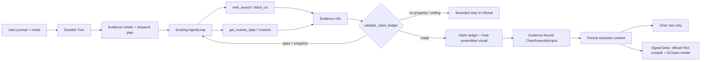

# Signal Desk Visual Research Harness

## Outcome

Trong mode `signal_desk`, một prompt chứng khoán tạo một durable Turn, tự lập
kế hoạch bằng chứng, tìm web, gọi Vnstock khi thiếu dữ liệu thị trường có cấu
trúc, kiểm tra readiness bằng code, rồi trả đồng thời:

1. câu trả lời text đã đi qua claim/evidence ledger trong Chat; và
2. một `ChartAssemblyInput` hợp lệ, lấy số chỉ từ evidence đã trace, được package
   Flint chính thức compile và ECharts render ở pane phải Signal Desk.

Agent được phép research sâu nhưng không được tự quyết định chạy vô hạn. Model
khai gap và đề xuất tool call; host giữ quyền cuối cùng về permission,
provenance, freshness, chart validity, budget và lý do dừng — và tự assemble
chart từ market call, model không gửi số nào.

## Scope Decisions

| Decision | Chốt |
|---|---|
| Visual core | Chọn [Microsoft Flint](https://github.com/microsoft/flint-chart), pin release đã kiểm chứng; `lieflat-charts` chỉ là visual benchmark, không vào runtime. |
| Flint integrity | Không fork, patch, copy template, sửa compiler output hoặc hậu xử lý ECharts option. Host chỉ chuẩn bị input và style khung panel. |
| Demo | Spike bằng npm package `flint-chart` pinned + một vitest compile fixture. Không MCP: adapter thừa cho một thư viện sẽ import trực tiếp. |
| Product integration | Dùng official `flint-chart` + ECharts trong web app; persist input, compile khi render, không persist generated ECharts option. |
| Agent architecture | Mở rộng `AgentLoop` hiện có; không tạo orchestrator, dispatcher, budget ledger hoặc state machine thứ hai. |
| Research source | `web_search`/`fetch_url` cho narrative và primary evidence; một tool `get_market_data` cho structured stock data. |
| Vnstock scope | Chỉ `ohlcv`, read-only, một mã/call, bounded rows. `quote`/`trades` cắt vì Phase 5–7 không consume và intraday 15m đã phủ độ mới. Không indicator, Study DSL, stock store, scheduler, watchlist hay order execution. |
| Deployment | Vnstock Community chỉ bật ở profile personal/non-commercial internal. Production fail-closed cho tới khi có software license và quyền upstream bằng văn bản. |
| UI contract | Chat chỉ render text/claim/evidence; visual chỉ render ở pane phải Signal Desk. Mode `chat` không tạo visual artifact. |
| Readiness | Không viết layer mới: host gate là `validate_claim_ledger` hiện có, state machine là `PipelineStage`, need là `ResearchDraft.gaps`. Model không bao giờ tự khai `ready`. |
| Bounds | Khởi đầu bằng lane deep hiện có: tối đa 10 tool rounds, 20 external calls, 1.800 giây; mọi model/tool/recovery call dùng chung envelope hiện có. |

## Architecture



No new path bypasses the current capability plane:

```text
model proposal
  → resolved tool surface
  → permission
  → per-Turn budget/deadline
  → TurnGuardrails
  → ToolExecutor
  → trace + evidence normalization
  → validate_claim_ledger
```

## Bounded Readiness Contract

Không có contract mới. Readiness đã là code đang chạy, và phase 4 chỉ dùng lại:

| Thuộc tính | Cơ chế hiện có |
|---|---|
| Host quyết định ready, model không | `evidence/ledger.py::validate_claim_ledger` recompute mọi verdict từ evidence; label của model không có authority |
| Trạng thái research | `PipelineStage` PLANNING → RESEARCH → COUNTEREVIDENCE → VERIFICATION → COMPLETE, deterministic |
| Evidence need | `ResearchDraft.gaps` + `ClaimLedger.gaps` (gộp research, counter, verifier), buộc bởi `DRAFT_FORMAT` |
| Refusal là first-class | `failed_ledger` + `_fail_deep_pipeline`: reason persisted, Turn settle terminal |
| Số phải có nguồn | `_numbers_supported` yêu cầu số xuất hiện đúng unit trong excerpt evidence |
| Thời gian phải hợp lệ | `_temporal_valid` + `is_temporally_admissible` |
| Multi-source / primary | `_accepted_verdict`: primary class → `VERIFIED`, hai publisher → `VERIFIED`, còn lại `SINGLE_SOURCE` |

Hệ quả đã chốt: `SourceClass.STORE` **không** thuộc `_PRIMARY_CLASSES`, nên một
material claim chỉ dựa vào số Vnstock ra `SINGLE_SOURCE` — và đó là nhãn đúng,
vì số đến từ feed KB Securities/Vietcap, không phải HOSE/HNX. Không nới rule.
Đường lên `VERIFIED` khi cần là cross-check hai provider độc lập (≥ 2 publisher,
`_accepted_verdict` đã hỗ trợ), không phải amend truth contract. Chi tiết và bẫy
publisher-count: Phase 3 §"Vì sao SINGLE_SOURCE là đúng".

### Anti-loop invariants

- Bound là `lanes.DEEP`: 10 round, 20 external call, 1.800s, với arithmetic
  invariant tự refuse ở `LaneProfile.__post_init__`.
- `TurnGuardrails` là ladder duy nhất: `call_signature` canonical args,
  `result_signature` cho no-progress, warn → block → halt. Blocked call không
  tốn external call nhưng vẫn tính vào ladder nên không quay vô hạn.
- Retry, format repair, verifier và Flint correction dùng chung envelope của
  Turn; đúng một strict-format repair mỗi artifact.
- Không thêm layer thứ hai enforce cùng invariant. Coverage digest và bộ đếm
  course-correct bị cắt: chúng chỉ bắt case "query khác, kiến thức như cũ",
  vốn đã bounded và terminate có reason (roadmap §4: bound để dừng có lý do,
  không để tiết kiệm tiền). Thêm lại khi corpus Phase 7 đo được round lãng phí.

## What Is Reused

- Hermes pattern: one result-aware model↔tool loop, bounded recovery, context
  pruning and explicit terminal reasons.
- OpenCode pattern: durable typed Turn state, resolved capability surface,
  permission and budget before dispatch.
- Oh My Pi pattern: checkpointed trajectory, course correction and full
  artifacts outside transient prompt context.
- Existing Stock_Massive runtime: `AgentLoop`, `LaneProfile`, `TurnGuardrails`,
  `ToolExecutor`, `TurnBudget`, claim ledger, typed progress, SSE replay,
  cancellation and terminal transaction.

Rejected: coding-agent shell/LSP/DAP surfaces, multi-agent delegation, a generic
MCP gateway, model-generated React/HTML, a second chart DSL and resurrecting the
retired Study/Board/widget stack.

## Delivery Phases

| # | Phase | Status | Effort | Dependency |
|---|---|---|---:|---|
| 1 | [Roadmap deviation](./phase-01-roadmap-deviation.md) | Todo | 1h | — |
| 2 | [Flint contract spike](./phase-02-flint-contract-spike.md) | Todo | 2h | 1 |
| 3 | [Vnstock market-data capability](./phase-03-vnstock-market-data-capability.md) | Todo | 8h | 1 |
| 4 | [Signal Desk mode + market evidence](./phase-04-evidence-readiness-agent-loop.md) | Todo | 6h | 3 |
| 5 | [Flint visual-artifact core](./phase-05-flint-visual-artifact-core.md) | Todo | 10h | 2, 4 |
| 6 | [Signal Desk right panel](./phase-06-signal-desk-right-panel.md) | Todo | 10h | 5 |
| 7 | [End-to-end quality gate](./phase-07-end-to-end-quality-gate.md) | Todo | 12h | 6 |

Phases are sequential at the roadmap level. Phase 2 and 3 may be developed in
parallel only after Phase 1 is accepted because they do not share runtime files;
Phase 4 starts only after the market contract is fixed.

## Cross-phase File Inventory

| Surface | Existing owner | Planned change |
|---|---|---|
| Product authority | `CLAUDE.md`, `docs/roadmap.md` | Approve the narrow deviation before code. |
| Runtime loop | `apps/api/src/agent/turns.py`, `service.py`, `evidence/pipeline.py` | Mode chọn lane + toolset; biến thể planning note. `loop.py`, `lanes.py`, `guardrails.py` không đổi. |
| Tool plane | `registry.py`, `toolsets.py`, `executor.py`, `tools/` | Register one bounded `get_market_data`. |
| Evidence | `apps/api/src/agent/evidence/` | Convert market rows to `STORE_FIGURE` evidence and bind visual values to IDs. |
| Durable message | `apps/api/src/agent/turns.py`, `persistence.py` | Add one optional versioned visual part to existing checkpoint/message JSON; no new artifact table. |
| Request contract | `apps/api/src/agent/schemas.py`, web API client | Add `mode: chat | signal_desk` atomically; default legacy requests to `chat`. |
| Visual runtime | `apps/web/src/lib/flint/`, `apps/web/package.json` | Pin `flint-chart` in Phase 2; one compile/validate function in Phase 5, reused by Phase 6 and 7. |
| Right pane | `inspector.tsx`, `desk-state.tsx`, `components/signal-desk/` | Render latest Turn visual at existing `Body` seam. |
| Release evidence | API/web tests and `apps/api/golden/` | Combined text/evidence/visual corpus and bounded-loop adversarial cases. |

## Success Criteria

- [ ] Accepted roadmap deviation explicitly opens Signal Desk visual mode, one
      Vnstock read capability and the Flint integration; all other retired paths
      remain retired.
- [ ] A Signal Desk Turn can use web + Vnstock, settle durably, reopen after
      refresh and render the same Flint chart input without re-running research.
- [ ] Chat mode emits no visual part and the transcript never renders a chart.
- [ ] Every visual number resolves to a normalized market evidence value and
      every visual series names evidence IDs and `as_of` metadata.
- [ ] Official Flint package is unmodified; no generated ECharts option is
      persisted or post-processed.
- [ ] Duplicate/failure adversarial tests prove no Turn exceeds 10 rounds, 20
      external calls or 1.800 seconds, and every exit has a reason — bằng
      guardrail và lane hiện có, không bằng layer readiness thứ hai.
- [ ] Material claim dựa trên số Vnstock ra `SINGLE_SOURCE`, không phải
      `UNSUPPORTED`; `_PRIMARY_CLASSES` không bị sửa.
- [ ] Vnstock is impossible to enable outside the personal internal profile;
      secrets never reach prompt, browser, trace or logs.
- [ ] Existing truth-contract hard gates stay green; the remaining Phase 6 paid
      quality gate is run once as part of the combined visual/evidence corpus.
- [ ] API focused/full suites, migration check if needed, web lint/type/test/build,
      `compileall`, `git diff --check` and retired-path scan pass.

## Risks And Rollback

| Risk | Containment | Rollback |
|---|---|---|
| Flint API/version drift | Pin exact package, compile fixtures in CI, upgrade only through canary. | Remove optional visual part and dependencies; text/evidence path remains. |
| Model emits plausible but invented chart values | Không thể xảy ra: model không gửi số nào, host assemble từ market call đã accepted. | Không có market call thì không có visual part; ledger không bao giờ bị nới. |
| Vnstock schema/unit/time drift | Pin version, validate/post-filter, raw+normalized hashes, source-specific contract tests. | Disable `get_market_data`; web evidence remains. |
| Tool storm/infinite loop | Ceiling của lane `DEEP` + ladder `TurnGuardrails`, cả hai đã ship và có test. | Gỡ mode + toolset market; loop hiện có không bị chạm. |
| License/upstream rights | Internal-only runtime gate; production hard-disabled. | Uninstall optional provider and retain provider-neutral tool contract only if still used. |
| Legacy Signal plan conflicts | This plan blocks and supersedes remaining work; no Study/Board code is reused. | Unblock old plan only by a new owner decision. |

<!-- slug: signal-desk-visual-harness -->
